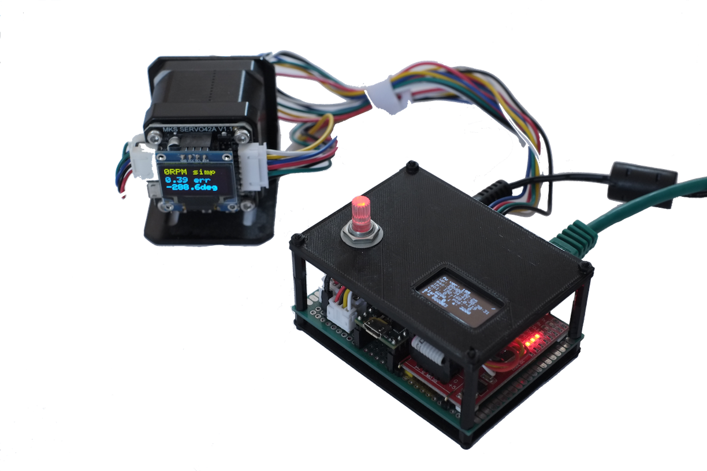

# Dummy step servo controler with modbus

## About The Project

This project is about building mock-up of an [Moons' Stepper Servo](https://www.moonsindustries.com/series/ss-series-step-servo-drives-a01030105) - SS-serie. The device helps developing a remote control web app with nodejs server without access to the Moons servo.
Some modbus registers are mapped in teensy 3.2 controler acording to Moons documentation so the server-servo communication could be tested.

## Hardware
* Teensy 3.2
* ACS712
* ethernet w5100 module
* OLED display
* rotary encoder with RGB led
* MKS Servo 42 with closed loop module

All compononents were mounted on an universal PCB with 3D printed front panel and back cover, to protect wireing.
OLED (monochromatic on the top of device) displays diagnostic informations like: IP address, values of some modbus registers - velocity, acceleration, servo current draw etc.
Rotary encoder is used for setting simulated error code.

## Built With
* [Atom](https://atom.io) - An amazing text editor
* [PlatformIO](https://platformio.org) - An ecosystem for embedded development

## License
This project is licensed under [MIT license](http://opensource.org/licenses/mit-license.php)

## Project status
- Prototype built and working.
- Firmware still under development.
